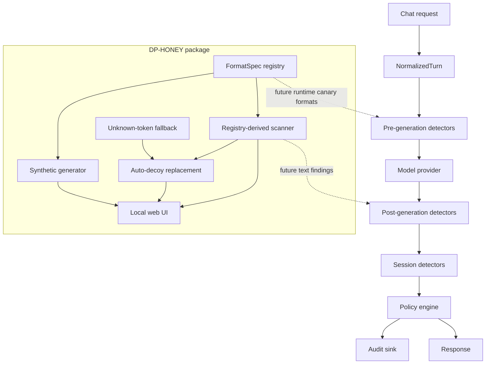

# Aegis

Aegis is a runtime credential-defense spine for LLM agents. It is designed to
sit between agent traffic and model/tool execution, normalize each turn, run
independent detector stages, apply policy in one place, and record auditable
events.

The repository is intentionally small right now. The current code establishes
the shared contracts and quality gates that future DP-HONEY, CIFT, NIMBUS,
proxy, SDK, dashboard, and evaluation work will plug into.

## Current Status

The first runtime spine is implemented and CI-enforced:

- Typed request, detector, policy, capability, and audit contracts.
- A minimal orchestrator that normalizes a turn, runs detector stages, calls a
  mock model provider, applies policy, and writes an audit event.
- A honeytoken ledger that replaces credential placeholders with registered
  canaries and emits `SensitiveSpan` metadata without exposing real secrets.
- DP-HONEY generator, scanner, auto-decoy fallback, CLI, and local web UI under
  `src/detect/dp_honey`.
- First detector seams:
  - `ActivationUnavailableDetector` for explicit CIFT capability reporting in
    black-box/mock mode.
  - `NoopCanaryDetector` as the unconfigured DP-HONEY/text-canary boundary.
  - `TextCanaryDetector` for exact post-generation detection of registered
    honeytoken leaks.
  - `EncodedCanaryDetector` for base64, hex, ROT13, leet, reverse,
    fragmentation, and partial-overlap canary leakage.
- A fixture-backed `cift_selector_probe_v0` candidate monitor replay path that
  consumes promoted calibrated CIFT scores without importing research code.
- A mock OpenAI-compatible proxy surface for `/health`,
  `/v1/chat/completions`, and `/audit/recent`.
- Mandatory CI gates for linting, formatting, strict typing, import-boundary
  checks, and tests with coverage.

This is not yet a production security system. It is the enforced skeleton that
keeps future detector and proxy work compatible.

## Runtime Shape



The core invariant is:

```text
Detectors produce evidence. Policy makes decisions. Audit records both.
```

Detectors return `DetectorResult` values. They do not call each other and do not
emit final enforcement decisions. The policy layer is the only layer that emits
`PolicyDecision`.

See [docs/aegis-runtime-spine.md](docs/aegis-runtime-spine.md) for the runtime
contract details.

## Quickstart

Install the project and development dependencies with `uv`:

```bash
uv sync --extra dev
```

Run the full local quality gate:

```bash
make quality
```

Run the built-in demo scenarios:

```bash
uv run python scripts/run_demo.py
```

Exercise the mock proxy in Python:

```python
from aegis.proxy.mock_app import create_default_proxy

proxy = create_default_proxy()
status, payload = proxy.handle(
    method="POST",
    path="/v1/chat/completions",
    body={
        "model": "mock-model",
        "messages": [{"role": "user", "content": "hello"}],
        "metadata": {"trace_id": "trace-1", "session_id": "session-1"},
    },
)

print(status)
print(payload["choices"][0]["message"]["content"])
print(payload["aegis"]["policy_decision"])
```

Run DP-HONEY commands:

```bash
uv run dp-honey list-formats
uv run dp-honey generate --format github-ghp --count 1 --seed 1
uv run dp-honey scan --file suspect.txt
uv run dp-honey auto-decoy --file suspect.txt --seed 1
```

Run the local DP-HONEY web UI:

```bash
uv sync --extra dev --extra dp-honey-ui
uv run dp-honey-ui
```

Then open `http://127.0.0.1:8000`.

## DP-HONEY Generator And Scanner

DP-HONEY creates synthetic, shape-only honeytokens for credential-leak detection
research. The values look like common secret families but are never
provider-valid, signed, decryptable, authenticated, or usable credentials.

The package has three main workflows:

- **Generate:** train a DP-noised character bigram model from a declarative
  format spec and emit synthetic decoys.
- **Scan:** detect registered secret-shaped spans without echoing matched values
  unless `--show-matches` is explicitly passed.
- **Auto-decoy:** replace detected spans with same-family synthetic decoys and
  return swapped text.

If pasted text contains a token that is not registered, DP-HONEY uses a
best-effort `unknown-token` fallback for long, high-entropy token-like strings.
Fallback findings are low confidence and preserve visible shape only; they do
not claim provider checksums, signatures, tenant IDs, account IDs, expiration
rules, or backend validity.

The Aegis-facing bridge keeps runtime responsibilities separated:

```text
src/detect/dp_honey/scanner.py
  -> src/aegis/detectors/dp_honey.py
  -> DetectorResult evidence
  -> policy decision
  -> src/aegis/proxy/dp_honey.py auto-decoy helper when policy selects sanitize
```

`src/aegis/canaries/dp_honey.py` provides `DPHoneyCanaryGenerator`, a callable
generator for `HoneytokenLedger`, plus `build_dp_honey_ledger()` for ledgers that
plant DP-HONEY-generated canaries while Aegis still owns registration,
`SensitiveSpan` metadata, and audit records.

The web UI sidebar maps to the same workflows:

| Sidebar section | What it does |
| --- | --- |
| **Formats** | Lists each registered token family with slug, category, description, provider-valid flag, and safety note. |
| **Preview corpus** | Shows uniformly sampled synthetic examples for one selected format before model training. |
| **Generate** | Produces synthetic honeytokens from a format or saved model artifact. |
| **Report** | Computes realism/sanity metrics such as validity rate, duplicate rate, character entropy, and average bigram log-likelihood. |
| **Scan & auto-decoy** | Detects registered secrets plus low-confidence `unknown-token` fallback matches, then can replace detected spans with synthetic decoys. |
| **Train** | Trains a reusable DP-noised bigram model and saves it into the local `models/` library. |
| **Inspect model** | Reads model metadata leniently so you can see schema version, format slug, registry version, privacy settings, alphabet size, safety note, and snapshot status. |
| **Validate** | Strictly validates a model artifact and reports whether it can be safely loaded for generation. |

See [src/detect/dp_honey/README.md](src/detect/dp_honey/README.md) for the full
format matrix, artifact schema, Python API, and safety boundaries.

## Quality Gates

The repository treats the runtime spine as an enforced contract. Pull requests
to `main` must pass CI on Python 3.11 and Python 3.12.

The local gate is:

```bash
make quality
```

It runs:

```bash
uv run --extra dev ruff check src/aegis src/detect tests/aegis tests/dp_honey scripts
uv run --extra dev ruff format --check src/aegis src/detect tests/aegis tests/dp_honey scripts
uv run --extra dev mypy src/aegis scripts
uv run python scripts/check_import_boundaries.py
uv run --extra dev pytest
```

Coverage is enforced at 90 percent for the runtime package.

## Repository Layout

```text
src/aegis/core/        Runtime contracts and orchestrator
src/aegis/canaries/    Honeytoken registration and injection helpers
src/aegis/demo/        Built-in runtime demo scenarios
src/aegis/detectors/   Detector stage implementations
src/aegis/policy/      Policy decision logic
src/aegis/audit/       Audit sinks
src/aegis/providers/   Model provider adapters
src/aegis/proxy/       Proxy adapters and mock proxy surface
src/aegis/replay/      Offline replay harnesses for fixtures and demos
src/aegis/sdk/         SDK entrypoint for embedding the runtime
src/detect/dp_honey/   DP-HONEY generator, scanner, CLI, and web UI
tests/aegis/           Runtime spine tests
tests/dp_honey/        DP-HONEY tests and synthetic golden fixture
scripts/               Repository quality and architecture checks
docs/                  Project and setup documentation
```

## Contribution Rules

New runtime work must preserve the spine boundaries:

- Adapters create `NormalizedTurn`; detectors consume normalized data.
- Detectors return `DetectorResult`; they do not emit `PolicyDecision`.
- Policy is the only layer that emits `PolicyDecision`.
- Audit records normalized input summary, detector outputs, policy decision,
  and latency.
- CIFT must emit either activation risk or explicit unavailable evidence.
- DP-HONEY injection/registration and canary detection remain separate stages.
- Real credentials cross runtime boundaries as handles, spans, hashes, or
  evidence, not raw production secrets.

See [CONTRIBUTING.md](CONTRIBUTING.md) before adding detector, policy, proxy, or
adapter code.

## Related Docs

- [Runtime spine](docs/aegis-runtime-spine.md)
- [Contributing](CONTRIBUTING.md)
- [Asana MCP setup](docs/ASANA_MCP_SETUP.md)
