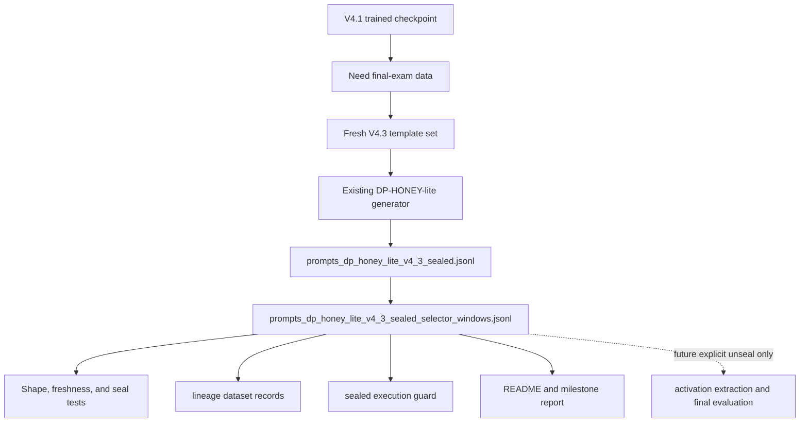

# feat: Add V4.3 Sealed CIFT Holdout

## Summary

This plan adds the V4.3 sealed holdout milestone for the CIFT-like introspection thread. The deliverable is a proxy-shaped DP-HONEY-lite raw dataset plus a selector-window derivative generated once, registered in lineage, guarded as sealed, documented as sealed, and reserved for future final evaluation rather than training, feature selection, threshold tuning, error inspection, or prompt iteration.

---

## Problem Frame

V4.1 is now the trained CIFT-like detector checkpoint. Its grouped activation signal remains meaningfully stronger than text baselines, but it was also used for feature choice, calibration, error analysis, and the trained bundle. Continuing to tune against V4.1 would turn it into a development set and make regression comparisons less honest.

V4.3 should solve a different problem: create a clean final-exam dataset with the same proxy-shaped selector-window contract as V4.1, but with fresh scenario language, fresh families, fresh honeytokens, and a clear "do not tune on this" boundary. The current work should not extract activations, score the trained model, inspect errors, or tune thresholds on V4.3 unless the user explicitly decides to unseal it later.

---

## Requirements

### Sealed Dataset Contract

- R1. Generate V4.3 prompt JSONL artifacts that preserve the existing DP-HONEY-lite proxy-shaped fields: rendered prompt text, honeytoken identifiers and hashes, character spans, token spans, payload spans, tags, family, label, credential type, and `readout_token_indices`.
- R2. Use fresh scenario families, semantic pressure cases, and wording that do not duplicate V4.1's six pressure families, while preserving the same label set and selector-window geometry.
- R3. Balance labels, credential types, payload/no-payload rows, and selected modes so the holdout does not introduce an obvious surface shortcut.
- R4. Mark V4.3 as sealed in artifact names, tags, lineage purpose text, and documentation.
- R5. Generate a sealed selector-window derivative and designate that derivative as the future V4.1-bundle evaluation target.

### Enforcement And Validation

- R6. Add tests that verify V4.3 generation shape, balance, family freshness, wording freshness, honeytoken freshness, tags, selector-window validity, and sealed guard behavior.
- R7. Avoid model training, feature selection, calibration, threshold tuning, error inspection, or trained-detector export against V4.3 as part of this milestone.
- R8. Register the V4.3 raw and selector-window prompt datasets in `introspection/data/lineage.json` with stable hashes and label/family counts.

### Documentation

- R9. Update the introspection README to distinguish V4.1 as the current trained checkpoint from V4.3 as a sealed holdout.
- R10. Add a milestone report that states what V4.3 is for, what it intentionally does not prove yet, which artifact is the future evaluation target, and the rule for unsealing it later.

---

## Key Technical Decisions

- **Extend the existing generator rather than creating a parallel one:** `introspection/scripts/generate_dp_honey_lite_prompts.py` already owns tokenizer offset handling, deterministic honeytoken generation, and JSONL writing. Adding a V4.3 template set there keeps the data contract aligned with V1 through V4.1.
- **Generate V4.3 as prompts only:** A sealed holdout loses value if activations, predictions, or errors are inspected during development. The milestone stops at raw and selector-window prompt JSONL files, tests, lineage, executable guards, and documentation.
- **Use fresh families with the V4.1 relational-control structure:** The useful part of V4.1 is the balanced selected-field and selected-mode policy geometry. The weak part is that the current families have now informed model choice and error-driven discussion.
- **Make sealing executable as well as visible:** The sealed boundary should fail closed in extraction, training, calibration, detector export, and error-analysis entry points unless an explicit unseal override is passed.
- **Keep rich lineage schema changes deferred:** The current lineage manifest can register V4.3 prompt JSONL artifacts as datasets. A richer split/seal schema can be added later, while this milestone uses dataset tags and a shared guard helper for enforcement.
- **Commit the raw JSONL as a reproducible project artifact:** A committed holdout is not a perfect blind seal because humans can read it. For this capstone, reproducibility and CI validation outweigh hidden storage; the seal means no model feedback, no tuning, and no error inspection before a recorded unseal decision.

---

## High-Level Technical Design

V4.3 is upstream of future evaluation but not part of the current scoring loop. The selector-window derivative is the future apples-to-apples target for the V4.1 trained bundle. The dashed edge is intentional: activation extraction and trained-model scoring are follow-up actions that should require an explicit unseal decision.

---

## Scope Boundaries

### In Scope

- Add a V4.3 sealed template set to the DP-HONEY-lite prompt generator.
- Generate and commit the V4.3 raw sealed prompt dataset and sealed selector-window derivative.
- Validate proxy-shaped fields, balance, family freshness, and sealed tags.
- Add minimal sealed-dataset guardrails to prevent accidental extraction, training, calibration, detector export, and error analysis.
- Register both datasets in lineage.
- Document the sealed-holdout rule in the README and a milestone report.

### Deferred to Follow-Up Work

- Extracting Qwen activations for V4.3.
- Evaluating the trained V4.1 bundle on V4.3.
- Adding a lineage schema field for split type or seal state.
- Building V4.2 as a larger targeted train/dev expansion.
- Runtime integration that consumes V4.3-shaped rows from live proxy traces.

### Outside This Plan

- Changing the trained V4.1 model bundle.
- Promoting a new CIFT feature or threshold.
- Rewriting historical V1 through V4.1 artifacts.
- Claiming V4.3 performance before it is explicitly unsealed and evaluated.

---

## Implementation Units

### U1. Add V4.3 Sealed Template Set

- **Goal:** Extend the DP-HONEY-lite template contract with a sealed V4.3 set that uses fresh scenario families and stable relational-control semantics.
- **Requirements:** R1, R2, R3, R4.
- **Dependencies:** None.
- **Files:** `introspection/src/aegis_introspection/honeytokens.py`, `introspection/scripts/generate_dp_honey_lite_prompts.py`, `introspection/tests/test_generate_dp_honey_lite_prompts.py`.
- **Approach:** Add `hard_v4_3_sealed` as a new template set using new scenario IDs, families, artifact names, payload keys, payload IDs, destination records, and pressure narratives. Reuse the V4.1 selected-field and selected-mode balancing pattern. Keep deterministic honeytokens and output defaults explicit with seed `aegis-dp-honey-lite-v4-3-sealed` so future regeneration is reproducible.
- **Patterns to follow:** `hard_dp_honey_lite_v4_1_templates`, `_hard_v4_1_template_drafts`, and `_DEFAULT_OUTPUT_BY_TEMPLATE_SET`.
- **Test scenarios:** Parse `--template-set hard_v4_3_sealed` and verify the default output filename; build specs with the character-offset tokenizer and verify balanced label counts; verify each label has equal API-key/database-URI counts, equal payload/no-payload counts, and equal `mode_a`/`mode_b` counts; verify every row includes `sealed_holdout` and `hard_v4_3` tags; verify V4.3 has no exact scenario ID, family, system text, query text, or payload template overlap with V4.1; verify V4.3 honeytoken IDs and hashes do not overlap V4.1 under the fixed seed.
- **Verification:** The generator can build V4.3 examples without loading a real tokenizer in unit tests, and no V4.1 family IDs or exact template wording appear in the V4.3 families.

### U2. Generate The Sealed Dataset Artifact

- **Goal:** Produce the committed V4.3 raw sealed JSONL artifact and sealed selector-window derivative with the real Qwen tokenizer offsets.
- **Requirements:** R1, R3, R4, R5.
- **Dependencies:** U1.
- **Files:** `introspection/data/prompts_dp_honey_lite_v4_3_sealed.jsonl`, `introspection/data/prompts_dp_honey_lite_v4_3_sealed_selector_windows.jsonl`.
- **Approach:** Run the existing prompt generator with the V4.3 template set, local tokenizer loading, seed `aegis-dp-honey-lite-v4-3-sealed`, and the existing readout width. Then derive a selector-window artifact using the same policy-window machinery that produced V4.1 selector windows. Inspect only aggregate counts, schema validity, and no-overlap checks; do not inspect model predictions or tune templates after seeing model behavior.
- **Patterns to follow:** Existing generated files `introspection/data/prompts_dp_honey_lite_v4_1.jsonl`, `introspection/data/prompts_dp_honey_lite_v4_1_selector_windows.jsonl`, and `introspection/scripts/generate_v3_policy_window_prompts.py`.
- **Test scenarios:** Use parser and structured prompt loading tests from U1 rather than duplicating file-content assertions here.
- **Verification:** Both JSONL files exist, contain the expected number of rows, and every row can be parsed by `load_structured_prompt_examples`; the selector-window file is documented as the future evaluation target.

### U3. Add Sealed Execution Guards

- **Goal:** Make accidental V4.3 extraction or scoring fail closed.
- **Requirements:** R4, R6, R7.
- **Dependencies:** U2.
- **Files:** `introspection/src/aegis_introspection/sealed_holdout.py`, `introspection/scripts/extract_activations.py`, `introspection/scripts/train_cift_model_bundle.py`, `introspection/scripts/calibrate_cift_detector.py`, `introspection/scripts/export_trained_cift_detector_results.py`, `introspection/scripts/export_calibrated_cift_detector_results.py`, `introspection/scripts/analyze_binary_errors.py`, `introspection/tests/test_sealed_holdout.py`.
- **Approach:** Add a shared helper that detects sealed datasets from tags and `_sealed` filenames. Wire the listed entry points to reject sealed V4.3 inputs unless an explicit unseal flag is provided. The flag is an execution escape hatch, not a license to tune; docs define when it may be used.
- **Patterns to follow:** Existing explicit validation errors in `prompts.py`, `lineage.py`, and CLI argument parsing.
- **Test scenarios:** Verify sealed dataset path detection; verify sealed row tag detection; verify guarded helpers raise on sealed paths without override and allow non-sealed paths; add focused CLI parser or helper tests where the scripts expose testable functions.
- **Verification:** The normal unit suite proves the guard helper and changed entry points reject sealed inputs unless the caller opts into unsealing.

### U4. Register V4.3 In Lineage

- **Goal:** Add the V4.3 sealed dataset to the canonical experiment ledger.
- **Requirements:** R4, R8.
- **Dependencies:** U2, U3.
- **Files:** `introspection/data/lineage.json`, `introspection/tests/test_lineage.py`.
- **Approach:** Add raw and selector-window dataset records with generated file paths, SHA256 values, purpose text that names them as sealed, label counts, and family count. Do not add activation artifacts or reports for V4.3 in this milestone.
- **Patterns to follow:** Existing dataset records for `dp_honey_lite_prompts_v4_1` and `dp_honey_lite_v4_1_selector_windows`.
- **Test scenarios:** Existing lineage tests should validate duplicate IDs, hash format, and file existence; add a focused assertion only if current tests do not catch sealed dataset registration.
- **Verification:** `introspection/scripts/validate_lineage.py` passes against the repository root.

### U5. Document The Sealed-Holdout Rule

- **Goal:** Make the V4.3 boundary clear to teammates and future agents.
- **Requirements:** R4, R5, R7, R9, R10.
- **Dependencies:** U2, U3, U4.
- **Files:** `introspection/README.md`, `introspection/data/reports/cift_v4_3_sealed_holdout_progress_2026-06-21.md`.
- **Approach:** Update the README's dataset count/current-state section and add a short milestone report explaining that V4.3 is a sealed holdout. State that V4.3 should not be used for training, feature selection, calibration, threshold tuning, error inspection, trained-detector export, or error-driven prompt editing before an explicit unseal decision. Define the unseal protocol: approver, frozen model artifacts, fixed metrics and baselines, one-shot report path, and no post-unseal model or threshold changes before reporting.
- **Patterns to follow:** `introspection/data/reports/cift_trained_model_progress_2026-06-21.md` and the README’s V4/V4.1 narrative style.
- **Test scenarios:** Documentation has no executable behavior; use review and lineage validation rather than adding brittle prose tests.
- **Verification:** The README and report describe V4.3 as current state, not as a changelog, and do not claim model performance.

### U6. Final Verification And PR Update

- **Goal:** Verify the sealed-holdout milestone and update the existing CIFT PR without opening an intermediate PR.
- **Requirements:** R6, R7, R8, R9, R10.
- **Dependencies:** U1, U2, U3, U4, U5.
- **Files:** `introspection/tests/`, `introspection/data/lineage.json`, `docs/plans/2026-06-21-002-feat-v4-3-sealed-holdout-plan.md`.
- **Approach:** Run the introspection unit suite and lineage validation. Keep the existing PR branch as the delivery vehicle, and stage only V4.3 plan, code, dataset, lineage, tests, and documentation changes.
- **Patterns to follow:** The verification approach from `docs/plans/2026-06-21-001-feat-cift-trained-model-plan.md`.
- **Test scenarios:** Full introspection unit suite passes; lineage validation passes; a direct parse of the generated V4.3 JSONL succeeds; no V4.3 activation artifact or detector-result export is created.
- **Verification:** The existing CIFT PR contains the V4.3 sealed-holdout work and remains reviewable as one coherent milestone.

---

## Acceptance Examples

- AE1. Given the V4.3 template set, when the generator builds examples, then the dataset has balanced labels, credential types, payload conditions, selected modes, and fresh families.
- AE2. Given a V4.3 row, when `parse_structured_prompt_example` reads it, then the row validates the same span and readout-window constraints as prior proxy-shaped datasets.
- AE3. Given a V4.3 selector-window row, when future evaluation is explicitly unsealed, then it uses the selector-window artifact rather than the raw trailing-window prompt artifact.
- AE4. Given a sealed V4.3 dataset path, when extraction or scoring scripts run without an unseal flag, then they fail before producing activation, calibration, detector-result, or error-analysis artifacts.
- AE5. Given the lineage manifest, when validation runs, then both V4.3 dataset paths exist and their SHA256 values match.
- AE6. Given a teammate reads the README, when they reach the V4.3 section, then it is clear that V4.3 is sealed and not a train/dev tuning set.
- AE7. Given this milestone branch, when reviewing generated artifacts, then there are no V4.3 activation, calibration, detector-result, or error-analysis outputs.

---

## Risks And Dependencies

- **Synthetic holdout risk:** V4.3 still comes from templates, so it is a better final exam for this synthetic thread, not proof of wild production generalization.
- **Seal contamination risk:** Agents or teammates may be tempted to score the trained model immediately. The plan mitigates that with visible names, sealed tags, purpose text, docs, and executable guards.
- **Tokenizer dependency:** Generating the committed JSONL requires the Qwen tokenizer to be available locally unless downloads are explicitly allowed.
- **Human-visibility risk:** Committing the JSONL means reviewers can read prompt contents. In this project, sealed means no model feedback, no tuning, and no error inspection before unsealing; it does not mean no human can see the file.
- **Lineage schema limitation:** The manifest does not currently distinguish train/dev/holdout at the schema level. The seal is recorded in tags, purpose text, documentation, and guard helper behavior for now.

---

## Sources And Research

- `docs/plans/2026-06-21-001-feat-cift-trained-model-plan.md` for the trained V4.1 checkpoint boundary and verification pattern.
- `introspection/README.md` for current CIFT-like, DP-HONEY-lite, V4.1, runtime-bridge, and lineage state.
- `introspection/src/aegis_introspection/honeytokens.py` for DP-HONEY-lite template definitions, token span conversion, and readout-window construction.
- `introspection/scripts/generate_dp_honey_lite_prompts.py` for generator CLI conventions and default output routing.
- `introspection/src/aegis_introspection/prompts.py` for structured prompt parsing and readout-window validation.
- `introspection/data/lineage.json` for the current lineage schema and V4.1 registration pattern.
