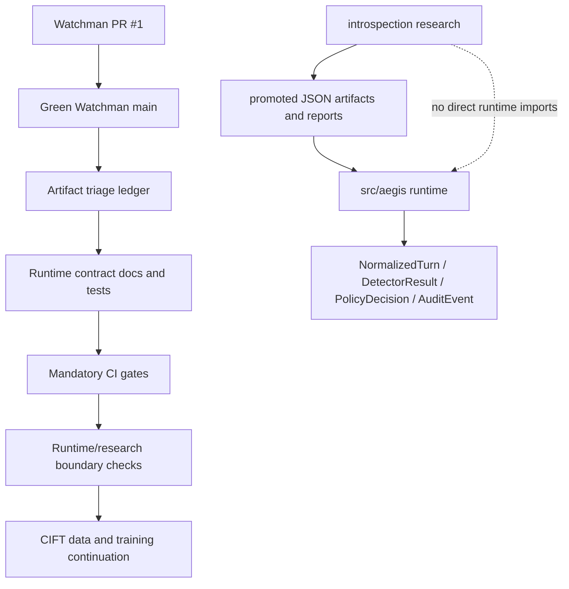

# feat: Stabilize Watchman Runtime Roadmap

## Summary

This plan moves the project from a green Watchman seed branch into a stricter working baseline. It merges the current Watchman PR, triages local experimental artifacts, codifies the runtime contract, hardens mandatory quality gates, keeps runtime and research boundaries separate, and resumes CIFT work only after the data contracts are stable.

---

## Problem Frame

The project has crossed an important boundary: Watchman is now the active remote, the runtime spine exists, and CI is enforcing meaningful checks. The local checkout also contains research artifacts and untracked NIMBUS/leakage experiments that could become valuable, but they should not leak into runtime by accident. The next work needs to reduce ambiguity before continuing CIFT training, because CIFT quality depends on trustworthy proxy-shaped data and stable runtime contracts.

---

## Requirements

- R1. Merge the green Watchman PR so `main` becomes the active baseline for future work.
- R2. Classify untracked local artifacts into generated data, research history, runtime candidates, or disposable files without staging unrelated work.
- R3. Promote the runtime contract as the governing contribution boundary for detectors, policy, audit, proxy, SDK, trace collection, and research adapters.
- R4. Harden mandatory CI gates around formatting, linting, typing, import boundaries, test coverage, and runtime/research separation.
- R5. Keep production runtime code in `src/aegis` and keep experiments, notebooks, activation tensors, training artifacts, and ablation reports in `introspection` until promotion.
- R6. Continue CIFT using the explicit selected-choice metadata and DP-HONEY-backed trace records, not heuristic prose parsing or ad hoc corpora.
- R7. Preserve audit safety: runtime boundaries carry handles, spans, hashes, scores, and evidence, never raw production credentials.

---

## Key Technical Decisions

- KTD1. **Watchman-first remote:** all pushes, PRs, and CI checks target `ccandelori/watchman`; the older Aegis remote is not used unless explicitly requested.
- KTD2. **Merge before expanding:** PR #1 is merged first so follow-up work starts from green `main` rather than stacking unrelated roadmap changes on the seed branch.
- KTD3. **Triage before promotion:** untracked files are inventoried and classified before any runtime promotion, because accidental staging is the highest near-term repo risk.
- KTD4. **Contracts over implementation coupling:** runtime work reinforces `NormalizedTurn -> DetectorResult -> PolicyDecision -> AuditEvent`; detector implementations do not own final policy or audit semantics.
- KTD5. **Quality gates are code, not convention:** contribution rules should be enforced by tests, import-boundary checks, CI commands, and schema/fixture checks rather than relying only on README prose.
- KTD6. **CIFT promotion remains artifact-based:** runtime CIFT consumes exported JSON artifacts and metadata feature vectors; `src/aegis` does not import `aegis_introspection`.

---

## High-Level Technical Design

The roadmap is dependency-ordered. CIFT work depends on the selected-choice contract and DP-HONEY trace shape being stable, so it comes after merge, triage, contract hardening, and boundary enforcement.

---

## Implementation Units

### U1. Merge Watchman PR #1

- **Goal:** Move the current green branch into Watchman `main`.
- **Requirements:** R1, R4
- **Dependencies:** none
- **Files:** no planned file edits
- **Approach:** Verify PR #1 is open, green, and targeting `ccandelori/watchman:main`, then merge it through GitHub. After merging, update the local checkout from Watchman `main` before starting new work.
- **Patterns to follow:** Use the existing Watchman remote and avoid the older `origin` remote.
- **Test scenarios:** Test expectation: none -- merge is a repository state transition already protected by PR CI.
- **Verification:** Watchman `main` contains the PR #1 commits and CI remains green.

### U2. Triage Untracked Local Artifacts

- **Goal:** Produce a durable inventory that classifies local untracked files without promoting them prematurely.
- **Requirements:** R2, R5, R7
- **Dependencies:** U1
- **Files:** `docs/watchman-artifact-triage.md`, `.gitignore`, optional edits to `README.md`
- **Approach:** Classify each untracked path as generated, research-history, runtime-candidate, or disposable. Generated trace data should remain ignored. Runtime-candidate files should get follow-up notes rather than being staged automatically.
- **Patterns to follow:** Follow the current trace harness rule that generated files live under `data/trace_collection/` and are ignored by git.
- **Test scenarios:**
  - Given the current dirty checkout, when triage runs, each untracked path is listed in exactly one category.
  - Given generated trace data, when `.gitignore` is checked, that data is not accidentally stageable by default.
  - Given runtime-candidate files, when triage completes, they have explicit next-action notes instead of silent promotion.
- **Verification:** `git status --short` shows only intentionally untracked local artifacts, and the committed triage document explains why none were staged.

### U3. Promote Runtime Contract Guidance

- **Goal:** Make the runtime spine boundaries contributor-facing and test-aligned.
- **Requirements:** R3, R5, R7
- **Dependencies:** U1, U2
- **Files:** `CONTRIBUTING.md`, `README.md`, `docs/aegis-runtime-spine.md`, `tests/aegis/test_contracts.py`, `tests/aegis/test_trace_collection.py`
- **Approach:** Add or repair contribution guidance that names the stable runtime contracts, detector boundaries, audit-safety rule, and CIFT promotion rule. Add focused contract tests only where behavior is not already covered.
- **Patterns to follow:** Mirror the existing README contribution rules and `scripts/check_import_boundaries.py`.
- **Test scenarios:**
  - Given a detector result, when serialized, it remains JSON-safe and contains evidence but no policy decision.
  - Given a trace collection record with selected-choice metadata, when converted for CIFT, fallback state is not contradictory.
  - Given audit evidence, when canary or credential handles are present, raw production secret values are absent.
- **Verification:** Contributor docs point to files that exist, and contract tests pass under CI.

### U4. Harden Quality Gates

- **Goal:** Extend the mandatory checks that protect the runtime spine without pulling heavy model-training dependencies into CI.
- **Requirements:** R4, R5, R7
- **Dependencies:** U3
- **Files:** `.github/workflows/ci.yml`, `scripts/check_import_boundaries.py`, `scripts/check_artifact_boundaries.py`, `tests/aegis/test_import_boundaries.py`, `tests/aegis/test_artifact_boundaries.py`, `pyproject.toml`
- **Approach:** Keep the current Python 3.11/3.12 matrix and add a lightweight artifact/boundary check if the repo lacks one. The check should block direct `aegis_introspection` imports from runtime, pycache files, generated trace outputs, activation tensors, and raw model artifacts from entering runtime paths.
- **Patterns to follow:** Reuse the AST-based style of `scripts/check_import_boundaries.py`.
- **Test scenarios:**
  - Given a runtime file importing `aegis_introspection`, when the boundary checker scans it, the check fails with an actionable message.
  - Given generated activation or trace artifacts outside allowed research/generated paths, when the artifact checker scans the repo, the check fails.
  - Given the current allowed runtime files, when quality gates run, they pass on Python 3.11 and 3.12.
- **Verification:** `make quality` or the CI-equivalent commands pass locally, and Watchman PR CI passes.

### U5. Separate Runtime and Research Workflows

- **Goal:** Make the boundary between production runtime code and introspection research visible in docs and enforceable by repository layout.
- **Requirements:** R5, R6
- **Dependencies:** U2, U3, U4
- **Files:** `introspection/README.md`, `README.md`, `docs/aegis-runtime-spine.md`, `.gitignore`, `docs/watchman-artifact-triage.md`
- **Approach:** Document the promotion path from research to runtime: notebook or script output becomes a versioned report, then an exported JSON artifact, then a runtime fixture or detector adapter. Keep notebooks, tensors, pickles, and ablation reports out of runtime imports.
- **Patterns to follow:** Follow the existing CIFT runtime adapter language in `docs/aegis-runtime-spine.md`.
- **Test scenarios:**
  - Given a future CIFT model artifact, when it is promoted, runtime loads JSON metadata and coefficients rather than a pickle.
  - Given research code in `introspection`, when runtime import boundaries run, no direct runtime import exists.
  - Given docs that reference contribution or promotion rules, when checked manually, referenced files exist.
- **Verification:** Docs describe one promotion path and no longer imply that research files can be imported directly by runtime.

### U6. Resume CIFT on Proxy-Shaped Data

- **Goal:** Continue CIFT work on the corrected selected-choice and DP-HONEY-backed trace records.
- **Requirements:** R6, R7
- **Dependencies:** U1, U2, U3, U4, U5
- **Files:** `introspection/README.md`, `introspection/data/reports/*`, `introspection/scripts/*`, `introspection/src/aegis_introspection/*`, `docs/trace-collection-harness.md`
- **Approach:** Regenerate or select the next CIFT corpus from paired semantic-indirection v3 trace records with explicit selected-choice metadata. Run extraction and training only after the corpus shape is documented, and compare readout-window features against text baselines before promoting any detector.
- **Patterns to follow:** Use existing trace CLI commands, selected-choice metadata, and runtime JSON artifact export path.
- **Test scenarios:**
  - Given generated paired semantic-indirection records, when converted to structured prompts, each non-benign selected-choice row has explicit token geometry or clear degraded fallback evidence.
  - Given a trained CIFT candidate, when evaluated, it is compared against text baselines and previous promoted artifacts.
  - Given an exported candidate, when loaded by runtime tests, it emits active/degraded/unavailable evidence without importing research code.
- **Verification:** A new CIFT report records corpus shape, baseline comparison, candidate metrics, and promotion recommendation.

---

## Scope Boundaries

- This plan does not implement a full production proxy, live model-host activation hooks, or a dashboard.
- This plan does not vendor large activation tensors or model weights into runtime.
- This plan does not replace DP-HONEY or NIMBUS implementations wholesale; it stabilizes their boundaries and triages follow-up work.
- This plan does not use the older Aegis remote for pushes or PRs.

### Deferred to Follow-Up Work

- Full paper-faithful CIFT reproduction remains a research follow-up if selected-choice runtime candidates do not improve.
- Real self-hosted model activation capture remains a connector/provider follow-up.
- Tool-call scanner coverage remains a runtime detector follow-up.
- Dashboard and live audit visualization remain product/demo follow-ups.

---

## System-Wide Impact

This work affects contributor workflow, CI behavior, runtime/research boundaries, and CIFT data reliability. It should reduce accidental coupling between `src/aegis` and `introspection`, make Watchman `main` a stable baseline, and turn local experimental artifacts into either documented follow-up work or ignored generated output.

---

## Risks & Dependencies

- **GitHub merge dependency:** U1 depends on Watchman PR #1 still being green and mergeable.
- **Dirty checkout risk:** U2 must avoid staging unrelated local artifacts while documenting them clearly.
- **CI scope risk:** U4 should not add heavyweight model dependencies to mandatory CI; torch/transformers work remains optional or research-local.
- **CIFT data risk:** U6 may show that selected-choice CIFT still underperforms text baselines; that result should be reported rather than hidden.
- **Boundary drift risk:** Documentation-only rules are insufficient unless CI or tests enforce them.

---

## Acceptance Examples

- AE1. Given Watchman PR #1 is green, when it is merged, then Watchman `main` becomes the baseline and future work branches from it.
- AE2. Given an untracked activation tensor, when triage completes, then it is classified as generated/research data and is not staged into runtime.
- AE3. Given a runtime file that imports `aegis_introspection`, when CI runs, then the import-boundary gate fails.
- AE4. Given a selected-choice semantic trace record, when it reaches CIFT conversion, then explicit selected-choice geometry is preferred and fallback evidence is not contradictory.
- AE5. Given a promoted CIFT candidate, when runtime loads it, then runtime consumes a JSON artifact and feature metadata without importing research modules.

---

## Sources & Research

- `README.md` defines the current runtime spine, contribution rules, and quality gate expectations.
- `docs/aegis-runtime-spine.md` documents runtime contracts, CIFT adapter boundaries, and NIMBUS-lite composition.
- `docs/trace-collection-harness.md` documents generated trace data, paired semantic-indirection profiles, and proxy-shaped CIFT data.
- `.github/workflows/ci.yml` defines the mandatory Python 3.11/3.12 CI matrix.
- `scripts/check_import_boundaries.py` is the existing pattern for enforcing runtime boundaries.
