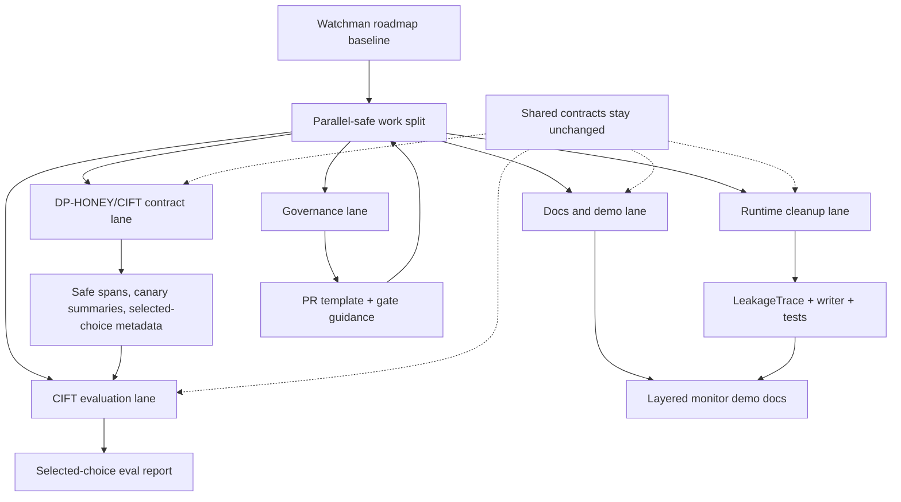

# feat: Execute Parallel Watchman Work Lanes

## Summary

This plan executes the next parallelizable Watchman slice after the runtime-roadmap baseline: promote audit-safe leakage trace primitives, validate DP-HONEY/CIFT metadata contracts, advance selected-choice CIFT evaluation, improve demo documentation, and add contributor governance that does not depend on changing shared contracts.

---

## Problem Frame

Watchman now has a runtime spine and a green roadmap branch, but several useful lanes are waiting behind the same baseline. The risky part is not the amount of work; it is accidentally changing shared contracts while CIFT, DP-HONEY, NIMBUS, runtime audit, and docs all depend on those contracts staying stable. The next pass should therefore parallelize only independent work and treat `NormalizedTurn`, `DetectorResult`, `PolicyDecision`, `AuditEvent`, and `metadata.cift` as serial design surfaces.

---

## Requirements

### Baseline And Branching

- R1. All work targets the Watchman remote and avoids the older Aegis remote.
- R2. The current green roadmap branch is treated as the baseline before additive work is promoted.
- R3. Unrelated untracked research files remain unstaged unless a unit names them.

### Runtime Cleanup

- R4. Leakage trace primitives cross runtime boundaries as handles, spans, labels, and safe metadata, not raw protected values.
- R5. Runtime leakage trace writing is covered by focused serialization and file-output tests.
- R6. NIMBUS session-state cleanup remains reachable through the proxy surface and covered by regression tests.

### Detector Contract Validation

- R7. DP-HONEY-backed trace records preserve canary IDs, hashes, spans, selected-choice CIFT metadata, and fake-secret safety boundaries.
- R8. CIFT selected-choice metadata remains the primary runtime route; payload/query readout remains degraded fallback coverage.
- R9. Runtime tests prove detector evidence can compose without raw canary or credential values in audit-facing records.

### CIFT Evaluation

- R10. Selected-choice CIFT evaluation uses the paired semantic-indirection v3 corpus already documented under the trace collection workflow.
- R11. Hidden-state extraction and training results are compared against text baselines and previous CIFT checkpoints before any promotion claim.
- R12. Heavy generated activation artifacts remain outside runtime and are not committed by default.

### Governance And Demo

- R13. Contributor-facing gates explain what must pass before a PR can merge.
- R14. Demo documentation shows the layered story: pre-output CIFT signal, post-output canary detection, cumulative NIMBUS risk, and policy decision.

---

## Assumptions

- The roadmap PR remains mergeable or already merged when implementation begins.
- Local hidden-state extraction uses the existing introspection environment and Qwen 0.6B path; if the model is unavailable, the CIFT unit records the blocker instead of fabricating an evaluation.
- DP-HONEY runtime integration is accepted as an existing component; this pass validates its contract rather than rewriting it.
- GitHub branch-protection settings may require repository-admin access, so code-enforced gates and PR-template guidance are in scope while remote settings changes are not assumed.

---

## Key Technical Decisions

- KTD1. **Keep shared contracts serial:** this pass does not redesign `NormalizedTurn`, detector result shape, policy decisions, audit events, or `metadata.cift`; each lane validates or consumes the existing shape.
- KTD2. **Promote leakage traces as runtime primitives:** the untracked leakage files are valuable because they express NIMBUS-compatible protected context references without exposing secret values.
- KTD3. **Validate DP-HONEY by contract tests:** the right integration proof is that DP-HONEY outputs safe handles/spans/canaries into runtime and CIFT metadata, not that the DP-HONEY generator is reimplemented.
- KTD4. **Treat CIFT extraction as research output:** hidden-state tensors, probe bundles, and ablation data stay in `introspection`; only reports or runtime-safe JSON artifacts become promotion candidates.
- KTD5. **Keep governance lightweight but enforceable:** repository docs and PR templates should point contributors to `make quality`, while CI and boundary tests remain the mechanical gate.

---

## High-Level Technical Design

The lanes are independent because they either add tests/docs around existing contracts or produce research artifacts outside runtime. Any change that would alter shared contract structure stops being parallel-safe and should move to a separate design pass.

---

## Implementation Units

### U1. Establish The Watchman Baseline

- **Goal:** Start additive work from the current green Watchman baseline without using the older remote.
- **Requirements:** R1, R2, R3
- **Dependencies:** none
- **Files:** no planned source edits
- **Approach:** Confirm the active branch and PR state, make sure the roadmap branch is represented on Watchman, and create any follow-up branch from the Watchman baseline or an already-merged roadmap commit.
- **Patterns to follow:** Follow `docs/plans/2026-06-23-002-feat-watchman-runtime-roadmap-plan.md` for Watchman-first remote handling.
- **Test scenarios:** Test expectation: none -- this is a repository state prerequisite.
- **Verification:** Future commits push to Watchman and `git status --short` shows unrelated untracked files are still unstaged.

### U2. Promote Audit-Safe Leakage Trace Primitives

- **Goal:** Turn the untracked leakage trace candidate files into typed runtime code if they satisfy the spine boundary.
- **Requirements:** R4, R5
- **Dependencies:** U1
- **Files:** `src/aegis/core/leakage.py`, `src/aegis/audit/leakage_trace.py`, `tests/aegis/test_leakage.py`, `tests/aegis/test_leakage_adapter.py`
- **Approach:** Review the candidate primitives for strict typing, raw-secret avoidance, immutable return behavior, and metadata allowlisting. Keep them focused on trace construction and JSONL writing; do not add a learned NIMBUS critic in this unit.
- **Patterns to follow:** Mirror `src/aegis/core/contracts.py` for JSON-safe serialization and `src/aegis/audit/memory.py` for audit-adjacent writer boundaries.
- **Test scenarios:**
  - Given a protected context reference, serializing it returns only handle, kind, source, and representation reference.
  - Given sensitive spans and metadata, building a leakage trace includes protected handles and drops metadata outside the allowlist.
  - Given a leakage trace writer and a temporary path, writing a trace produces one JSONL row with no raw secret value.
  - Given malformed or missing handles, trace construction omits invalid protected references rather than inventing one.
- **Verification:** Runtime tests cover leakage trace serialization and no raw production secret literal is copied into trace evidence.

### U3. Strengthen NIMBUS Runtime Contract Tests

- **Goal:** Promote the untracked NIMBUS contract and session-destruction tests when they match the runtime spine.
- **Requirements:** R4, R6, R9
- **Dependencies:** U1
- **Files:** `tests/aegis/test_nimbus_critic_contract.py`, `tests/aegis/test_nimbus_session_destruction.py`, `src/aegis/detectors/nimbus.py`, `src/aegis/proxy/mock_app.py`
- **Approach:** Keep the existing `NimbusDetector` protocol surface intact. Add tests that prove critics return valid bounded scores, invalid scores fail explicitly, secret handles do not leak through score objects, and mock proxy session destruction clears NIMBUS state.
- **Patterns to follow:** Reuse `tests/aegis/test_nimbus.py` and `tests/aegis/test_nimbus_runtime.py` instead of creating a competing NIMBUS abstraction.
- **Test scenarios:**
  - Given the baseline critic, scoring a turn returns a non-negative leakage estimate and bounded confidence.
  - Given a bad critic, detector evaluation raises a specific configuration error.
  - Given a session that is destroyed through the proxy, a later turn recreates state rather than reusing stale cumulative leakage.
  - Given a secret handle, critic scoring and detector evidence do not expose the handle as model-visible text.
- **Verification:** NIMBUS-focused tests pass and no production code path loses explicit session cleanup.

### U4. Validate DP-HONEY To CIFT Metadata Composition

- **Goal:** Add focused contract coverage for the DP-HONEY-backed selected-choice data path without rewriting DP-HONEY.
- **Requirements:** R7, R8, R9
- **Dependencies:** U1
- **Files:** `tests/aegis/test_trace_collection.py`, `src/aegis/trace_collection/harness.py`, `introspection/src/aegis_introspection/trace_record_adapter.py`, `docs/trace-collection-harness.md`
- **Approach:** Exercise the trace harness path that emits fake-secret spans, canary summaries, and `metadata.cift.selected_choice`. Assert new paired semantic-indirection v3 records prefer explicit selected-choice geometry and do not carry contradictory fallback evidence.
- **Patterns to follow:** Follow the selected-choice metadata language already documented in `docs/trace-collection-harness.md`.
- **Test scenarios:**
  - Given a paired semantic-indirection v3 generated prompt, trace metadata contains selected-choice geometry and `fallback_reason` is absent.
  - Given a benign row, conversion preserves null secret spans without forcing fake selected-choice evidence.
  - Given a secret-bearing row, canary IDs and hashes appear while raw canary values stay out of audit-facing evidence.
  - Given legacy records without selected-choice metadata, adapter fallback remains labeled as degraded compatibility.
- **Verification:** Contract tests pass and docs state the selected-choice path as the primary CIFT route.

### U5. Advance Selected-Choice CIFT Evaluation

- **Goal:** Run the next CIFT checkpoint on the 720-row paired semantic-indirection v3 corpus and record the result honestly.
- **Requirements:** R10, R11, R12
- **Dependencies:** U1, U4
- **Files:** `introspection/data/reports/*`, `introspection/scripts/*`, `introspection/src/aegis_introspection/*`, `introspection/README.md`
- **Approach:** Use the existing structured prompts and CIFT scripts to smoke hidden-state access, extract selected-choice readout features, train the candidate probe, and compare against text baselines and prior checkpoints. Commit only small reports or runtime-safe artifacts; leave activation tensors and generated corpora ignored unless a deliberate fixture is needed.
- **Patterns to follow:** Follow `docs/trace-collection-harness.md` and the current CIFT promotion boundary in `introspection/README.md`.
- **Test scenarios:**
  - Given the structured v3 corpus, extraction covers all non-benign selected-choice rows or records the missing coverage count.
  - Given a trained candidate, evaluation reports grouped metrics and text-baseline comparisons.
  - Given a candidate that underperforms, the report states that result and does not promote it.
  - Given generated tensors or probe bundles, artifact boundary checks keep them out of runtime paths.
- **Verification:** A report records corpus shape, extraction status, model comparison, and promotion recommendation.

### U6. Improve Demo And Contributor Documentation

- **Goal:** Make the layered monitor story and mandatory gates easier for contributors to follow.
- **Requirements:** R13, R14
- **Dependencies:** U1, U2, U3, U4
- **Files:** `README.md`, `CONTRIBUTING.md`, `docs/aegis-runtime-spine.md`, `docs/trace-collection-harness.md`, `.github/pull_request_template.md`, `tests/aegis/test_demo_scenarios.py`
- **Approach:** Add a PR template or contributor section that requires quality-gate evidence and contract-boundary notes. Update docs to show how CIFT, DP-HONEY canary detection, NIMBUS, policy, and audit compose in the current demo.
- **Patterns to follow:** Keep documentation as current-state guidance, not a changelog.
- **Test scenarios:**
  - Given demo scenarios render, output includes the layered CIFT, canary, and NIMBUS story without exposing raw canary material.
  - Given a contributor reads the PR template, it asks for quality gates and contract-boundary impact.
  - Given docs reference commands or files, the referenced paths exist.
- **Verification:** Demo tests pass and contributor docs match the enforced `make quality` gate.

---

## Scope Boundaries

- This plan does not redesign shared runtime contracts.
- This plan does not merge heavy model weights, activation tensors, or generated trace corpora.
- This plan does not replace DP-HONEY, CIFT, or NIMBUS implementations wholesale.
- This plan does not depend on branch-protection admin settings being available.
- This plan does not use the older Aegis remote.

### Deferred To Follow-Up Work

- Paper-faithful CIFT CCI/CFS reproduction remains separate from the selected-choice runtime candidate evaluation unless the evaluation report recommends it.
- Live self-hosted model hooks remain a provider workstream after offline selected-choice evaluation is credible.
- Tool-call scanner coverage remains a detector workstream after the current monitor composition is stable.
- Dashboard and live SSE visualization remain a product/demo workstream.

---

## System-Wide Impact

This work touches runtime audit safety, detector-contract confidence, CIFT research reproducibility, demo clarity, and contributor workflow. It should reduce the chance that independent contributors accidentally move hidden-state research artifacts into runtime or change detector contracts while parallel detector work is underway.

---

## Risks & Dependencies

- **Stacked-branch risk:** if the roadmap PR is not merged first, the resulting PR may include already-reviewed baseline changes. Mitigation: verify the Watchman baseline before committing follow-up work.
- **CIFT compute risk:** hidden-state extraction may be slow or unavailable on the local model environment. Mitigation: run a smoke first and record blockers instead of claiming an evaluation.
- **Boundary drift risk:** DP-HONEY, CIFT, and NIMBUS all want adjacent metadata. Mitigation: add contract tests and avoid schema changes in this pass.
- **Artifact risk:** activation tensors and generated corpora can be large. Mitigation: keep generated data ignored and commit reports rather than raw tensors.
- **Governance risk:** PR templates help contributors but do not enforce branch protection. Mitigation: keep enforcement in CI and artifact/import boundary scripts.

---

## Acceptance Examples

- AE1. Given the active repository has both `origin` and `watchman`, when work is pushed, then it goes to Watchman only.
- AE2. Given a leakage trace built from sensitive spans, when it is serialized, then it contains handles and safe metadata but not raw protected values.
- AE3. Given a paired semantic-indirection v3 trace, when converted for CIFT, then explicit selected-choice geometry is primary and fallback evidence is not contradictory.
- AE4. Given the selected-choice CIFT corpus, when evaluation completes, then the report compares hidden-state features against text baselines and prior checkpoints.
- AE5. Given a contributor opens a PR, when they read the template and CI, then quality gates and runtime/research boundary expectations are visible.
- AE6. Given a layered demo scenario, when it runs, then CIFT, text canary, NIMBUS, policy, and audit compose without leaking raw canary values.

---

## Sources & Research

- `docs/plans/2026-06-23-002-feat-watchman-runtime-roadmap-plan.md` defines the current Watchman baseline and runtime/research boundary work.
- `README.md` describes the runtime spine, quality gates, and current detector seams.
- `docs/aegis-runtime-spine.md` defines the current CIFT, DP-HONEY, NIMBUS, policy, and audit boundaries.
- `docs/trace-collection-harness.md` documents the selected-choice paired semantic-indirection v3 corpus path.
- `introspection/README.md` defines the CIFT promotion boundary and the distinction between research artifacts and runtime artifacts.
- `src/aegis/detectors/nimbus.py` contains the current NIMBUS contract and session detector surface.
- `src/aegis/trace_collection/harness.py` contains the DP-HONEY-backed trace metadata emission path.
