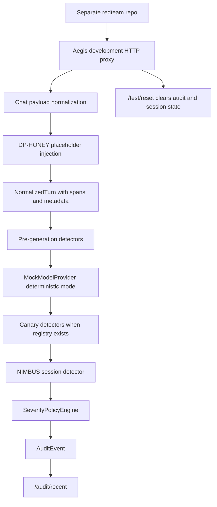

# feat: Make Aegis a Redteam-Probeable Runtime Target

## Summary

This plan turns the current Aegis development proxy into a usable black-box target for a separate redteam repository. Aegis will own the HTTP contract, deterministic mock-model controls, DP-HONEY canary injection, detector/audit readback, and reset affordances. The redteam runner itself remains outside this repo.

---

## Problem Frame

The runtime spine exists and the development HTTP proxy can be started, but a separate redteam cannot yet run meaningful controlled probes against it. The default mock provider returns one benign response, DP-HONEY canaries are available as runtime helpers but not planted through the proxy path, and run isolation is awkward because audit/NIMBUS state cannot be reset through the HTTP contract. The next slice should make Aegis probeable without turning the Aegis repo into the redteam repo.

---

## Assumptions

- The current `codex/redteam-http-affordance` branch remains the active work branch and targets `ccandelori/watchman`.
- The separate redteam repository will call Aegis over HTTP and should not import `src/aegis`.
- The HTTP proxy in this slice is a development/test target, not a production enforcement gateway.
- Mock-model controls are acceptable only inside the development proxy because they intentionally simulate adversarial model behavior.

---

## Requirements

- R1. Aegis exposes a stable development HTTP target with `/health`, `/v1/chat/completions`, `/audit/recent`, and a reset route for repeatable tests.
- R2. A separate redteam can trigger deterministic benign, direct-leak, encoded-leak, and partial-leak mock responses through OpenAI-compatible chat payloads.
- R3. The proxy can plant DP-HONEY honeytokens from credential placeholders before model generation and attach audit-safe sensitive span metadata.
- R4. When canaries are planted, post-generation canary detectors run against the mock model output and policy receives ordinary `DetectorResult` values.
- R5. Reset behavior clears audit events and session state needed for repeatable redteam runs without requiring Python object access.
- R6. Aegis does not own the redteam runner or scenario library; it only owns the target contract and development controls.
- R7. Runtime evidence and audit records do not copy raw production secrets across boundaries. Fake honeytokens may appear in model-visible messages and generated output during controlled tests.
- R8. Docs show how to start Aegis locally and how an external redteam should shape requests and read results.

---

## Key Technical Decisions

- KTD1. **Keep the redteam runner out-of-repo:** Aegis should not grow `aegis.redteam` as a scenario framework. The repo should expose a black-box HTTP target and contract examples; the separate redteam repo owns runners, scenario packs, scoring, and reports.
- KTD2. **Use metadata-gated mock controls:** Deterministic adversarial behavior belongs in `MockModelProvider` and is selected through request metadata. This keeps normal chat payload shape intact while giving external tests positive and negative controls.
- KTD3. **Inject canaries at the proxy boundary:** Credential placeholders should be replaced before `NormalizedTurn` reaches detectors or providers. This mirrors the intended DP-HONEY pipeline and keeps detectors focused on normalized turns and model outputs.
- KTD4. **Build canary detectors per request when canaries exist:** Canary registries are request/session context, so the proxy should compose post-generation detectors from planted canary records instead of relying on a static no-op detector.
- KTD5. **Expose reset as a development route:** A redteam needs repeatable runs. A `POST /test/reset` route is acceptable on the development proxy, but it should be documented as non-production target control.

---

## High-Level Technical Design

The redteam remains black-box from Aegis's perspective. It sends ordinary HTTP requests, selects deterministic mock behavior through metadata, and evaluates the assistant response plus the `aegis` detector/policy block. The in-process proxy remains useful for unit tests but is not the redteam integration boundary.

---

## Implementation Units

### U1. Keep Aegis focused on the target contract

- **Goal:** Remove in-repo redteam-runner abstractions from the current branch and keep only Aegis-side proxy affordances.
- **Requirements:** R1, R6, R8
- **Dependencies:** none
- **Files:** `src/aegis/redteam/__init__.py`, `src/aegis/redteam/targets.py`, `tests/aegis/test_redteam_targets.py`, `README.md`
- **Approach:** Delete the Aegis-owned target adapter package and replace README wording with an HTTP-first contract note for external redteam repos. Keep the FastAPI development proxy and its tests.
- **Patterns to follow:** Existing `README.md` contribution boundary language and `tests/aegis/test_proxy_http_app.py`.
- **Test scenarios:**
  - Given the package layout, importing `aegis.redteam` is no longer part of the Aegis runtime surface.
  - Given README quickstart instructions, the redteam integration path points at HTTP rather than Python imports.
  - Given the existing HTTP proxy tests, `/health`, `/v1/chat/completions`, and `/audit/recent` remain covered.

### U2. Add deterministic mock-provider response modes

- **Goal:** Let an external redteam produce controlled model outputs without real model calls.
- **Requirements:** R2, R7
- **Dependencies:** U1
- **Files:** `src/aegis/providers/mock.py`, `tests/aegis/test_proxy.py`, `tests/aegis/test_proxy_http_app.py`, `README.md`
- **Approach:** Extend `MockModelProvider` to read a constrained `metadata.mock_response_mode` value. Preserve existing `metadata.mock_response` behavior. Add modes for default benign response, explicit static response, first planted honeytoken leak, base64 first planted honeytoken leak, and partial first planted honeytoken leak.
- **Patterns to follow:** Existing `MockModelProvider.generate` metadata lookup and typed error-handling style in proxy request validation.
- **Test scenarios:**
  - A request without `mock_response_mode` returns the default mock response.
  - A request with `mock_response` still returns that exact string.
  - A request with a supported leak mode returns deterministic output derived from model-visible honeytoken text.
  - A request with an unsupported mode returns a clear proxy validation error.

### U3. Plant DP-HONEY canaries through the proxy path

- **Goal:** Make the HTTP proxy exercise the same canary injection and detection concepts a redteam needs to probe.
- **Requirements:** R3, R4, R7
- **Dependencies:** U2
- **Files:** `src/aegis/proxy/mock_app.py`, `src/aegis/canaries/ledger.py`, `tests/aegis/test_proxy.py`, `tests/aegis/test_proxy_http_app.py`
- **Approach:** During chat normalization, replace credential placeholders in messages with fake honeytokens, attach resulting `SensitiveSpan` values to the `RuntimeRequest`, and preserve audit-safe canary summaries. When canary records exist, compose `TextCanaryDetector` and `EncodedCanaryDetector`; otherwise keep the no-op canary boundary.
- **Patterns to follow:** `inject_honeytokens`, `HoneytokenInjectionResult.canary_registry`, `TextCanaryDetector`, and `EncodedCanaryDetector`.
- **Test scenarios:**
  - A placeholder-bearing prompt produces model-visible honeytoken text and audit sensitive spans with hashes, IDs, and credential type metadata.
  - A direct-leak mock response triggers text canary detection and an escalate policy decision.
  - A base64-leak mock response triggers encoded canary detection without requiring exact text detection.
  - Audit evidence does not copy the raw canary value into detector evidence.

### U4. Add repeatable-run reset controls

- **Goal:** Let external test runners reset development proxy state between campaigns.
- **Requirements:** R1, R5, R8
- **Dependencies:** U3
- **Files:** `src/aegis/audit/memory.py`, `src/aegis/proxy/mock_app.py`, `src/aegis/proxy/http_app.py`, `tests/aegis/test_proxy.py`, `tests/aegis/test_proxy_http_app.py`, `README.md`
- **Approach:** Add an audit sink clear method and a development-only `POST /test/reset` route. The route clears audit events and optionally destroys a supplied NIMBUS session ID.
- **Patterns to follow:** Existing `MockProxyApp.destroy_session` and FastAPI route wrapper style in `src/aegis/proxy/http_app.py`.
- **Test scenarios:**
  - After a chat completion writes audit, `POST /test/reset` clears `/audit/recent`.
  - Reset with a session ID destroys NIMBUS session state for that session.
  - Invalid reset payloads return HTTP 400 with actionable messages.
  - The reset route is documented as a development/test affordance, not a production API.

### U5. Document the external redteam contract

- **Goal:** Make the target contract usable by teammates building the separate redteam repo.
- **Requirements:** R1, R2, R5, R6, R8
- **Dependencies:** U1, U2, U3, U4
- **Files:** `README.md`, `docs/aegis-runtime-spine.md`
- **Approach:** Document the local start command, routes, required request shape, supported mock response modes, placeholder format, reset route, and expected response fields. Keep scenario runner and result schema guidance out of Aegis except as high-level integration notes.
- **Patterns to follow:** Existing README quickstart and runtime boundary sections.
- **Test scenarios:** Test expectation: none -- documentation describes behavior covered by U1-U4 tests.

---

## Scope Boundaries

- This plan does not create the separate redteam repository.
- This plan does not implement a scenario runner, scoring dashboard, or attack corpus.
- This plan does not add real model pass-through or self-hosted activation capture.
- This plan does not make `POST /test/reset` a production API.
- This plan does not claim paper-faithful CIFT or NIMBUS improvements.

### Deferred to Follow-Up Work

- A separate redteam repo with `HttpAegisTarget`, scenario packs, JSONL results, and scoring.
- A production proxy mode with real model/provider pass-through and no mock response controls.
- A persistent NIMBUS store for long-running deployments.
- A self-hosted model provider that can attach live activation features for CIFT.

---

## System-Wide Impact

This work sharpens the boundary between Aegis and the future redteam repo. Aegis becomes a deterministic, HTTP-addressable security target with auditable detector results. The redteam can remain adversarial and black-box while still getting positive controls for canary leaks and policy assertions.

---

## Risks & Dependencies

- **Development controls could be mistaken for production controls:** Mock response modes and reset routes must be documented as development-only.
- **Canary value exposure in audit:** Model-visible fake honeytokens may appear in generated output, but detector evidence should continue to use hashes, IDs, spans, and metadata rather than copying raw values.
- **Static detector composition may not fit dynamic canary registries:** The implementation may need per-request runtime composition for post-generation canary detectors.
- **PR scope creep:** The separate redteam repo should not be folded into this branch.

---

## Acceptance Examples

- AE1. Given Aegis is running locally, when an external client calls `/health`, then it receives `{"status": "ok"}`.
- AE2. Given a chat request with a credential placeholder and direct-leak mock mode, when the request is evaluated, then Aegis returns a response with canary detector evidence and an escalate policy decision.
- AE3. Given a chat request with a credential placeholder and base64-leak mock mode, when the request is evaluated, then encoded canary detection produces the highest detector recommendation.
- AE4. Given prior audit events, when an external client calls `POST /test/reset`, then subsequent `/audit/recent` output is empty.
- AE5. Given README instructions, when a teammate builds the separate redteam repo, then they can target Aegis through HTTP without importing Aegis Python modules.

---

## Sources & Research

- `src/aegis/core/contracts.py` defines the stable `NormalizedTurn`, `DetectorResult`, `PolicyDecision`, and `AuditEvent` boundary.
- `src/aegis/core/orchestrator.py` composes pre-generation, post-generation, and session detectors.
- `src/aegis/proxy/mock_app.py` owns the current OpenAI-compatible mock proxy normalization path.
- `src/aegis/proxy/http_app.py` wraps the mock proxy as FastAPI routes.
- `src/aegis/providers/mock.py` already supports deterministic `metadata.mock_response` output.
- `src/aegis/canaries/ledger.py` plants honeytokens and emits audit-safe sensitive spans.
- `src/aegis/detectors/canary.py` provides exact and encoded canary detectors.
- `src/aegis/detectors/nimbus.py` provides resettable in-memory NIMBUS state through `destroy_session`.
