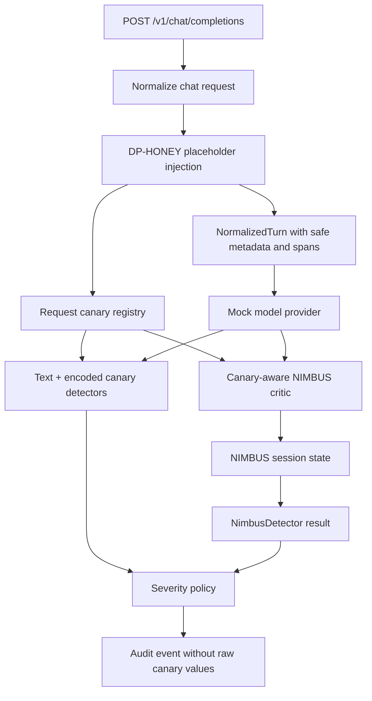

# feat: Add NIMBUS canary-aware leakage critic

## Summary

This plan makes NIMBUS useful in the runtime by replacing the current zero-leakage baseline critic with a canary-aware leakage critic that accumulates exact, encoded, and partial canary evidence across turns. The work keeps `NimbusDetector` and `NimbusCritic` as the canonical runtime shape, leaves research prototypes separate, and exposes stateful leakage behavior through the existing proxy, audit, and redteam HTTP affordances.

---

## Problem Frame

The runtime already has the right NIMBUS seam: `NimbusDetector` owns session state and delegates per-turn leakage estimation to a `NimbusCritic`. The default proxy still uses `BaselineNimbusCritic(fixed_estimated_leakage_bits=0.0)`, so redteam probes can see a NIMBUS result but cannot observe useful cumulative leakage behavior. There is also an older `NimbusLeakageDetector` path that rescans canaries and accumulates a normalized score, but growing that path would keep two competing NIMBUS implementations alive.

The next step is to put real canary-derived scoring behind the canonical critic interface, then wire the proxy so the same DP-HONEY canary records used by text canary detectors can inform NIMBUS without persisting raw canary values in normalized turns or audit events.

---

## Requirements

**Canonical NIMBUS runtime**

- R1. Runtime NIMBUS uses `NimbusDetector` plus a `NimbusCritic`; the older `NimbusLeakageDetector` remains compatibility code or is demoted from the proxy path.
- R2. A canary-aware critic estimates per-turn leakage bits from exact, encoded, and partial canary evidence in model output.
- R3. NIMBUS accumulates leakage by `session_id` and maps cumulative budget fraction to `allow`, `warn`, `sanitize`, and `block`.

**Proxy and audit behavior**

- R4. The default proxy wires the canary-aware critic whenever DP-HONEY placeholder injection plants canaries for a request.
- R5. Raw canary values do not cross audit or normalized-turn boundaries; NIMBUS evidence uses canary IDs, match categories, counts, hashes, fractions, and budget metadata.
- R6. `POST /test/reset` clears audit events and resets NIMBUS session state for the supplied `session_id`.

**Verification**

- R7. Tests prove exact, base64, and partial planted-canary leaks contribute leakage bits.
- R8. Tests prove repeated partial leakage across turns accumulates into stronger policy actions.
- R9. Tests prove unplanted credential-shaped strings do not become NIMBUS leakage evidence.

---

## Key Technical Decisions

- KTD1. Canonicalize on `NimbusDetector` and `NimbusCritic`: this keeps NIMBUS aligned with the runtime spine, where detectors emit ordinary `DetectorResult` objects and policy remains the only layer that emits final decisions.
- KTD2. Keep canary registries runtime-local: the proxy can build request-scoped canary detectors and a session-scoped NIMBUS critic from planted `CanaryRecord` objects, but normalized turn metadata must only carry safe summaries.
- KTD3. Score leakage in bits, not normalized detector score: `NimbusDetector` already owns cumulative budget math, so the critic should return `NimbusCriticScore(estimated_leakage_bits, confidence)` rather than bypassing the budget model.
- KTD4. Preserve independent post-output detectors: text and encoded canary detectors still emit immediate exact evidence, while NIMBUS emits cumulative session risk from its own critic scan.
- KTD5. Prefer deterministic local matching over LLM judging for this slice: redteam needs repeatable positive controls first; learned or LLM-based NIMBUS critics can be evaluated later.

---

## High-Level Technical Design

The proxy composes detectors per request because canary records are created during request normalization. The NIMBUS critic must therefore receive canary records through a registry provider or equivalent session-aware structure, while the `NormalizedTurn` remains safe to persist.

---

## Scope Boundaries

- Keep this branch focused on deterministic canary-derived NIMBUS-lite behavior; do not implement the paper's full learned NIMBUS critic.
- Do not change the detector interface to pass post-generation detector outputs into session detectors unless implementation proves independent rescanning is untenable.
- Do not expose raw planted canaries through the HTTP response, audit endpoint, normalized turn metadata, or test fixtures.
- Do not move CIFT or introspection artifacts in this branch.
- Do not build the external redteam runner in this repository.

---

## Implementation Units

### U1. Add canary-aware NIMBUS critic

- **Goal:** Implement a `NimbusCritic` that scans model output against planted canary records and returns leakage-bit estimates with safe evidence inputs.
- **Requirements:** R1, R2, R5, R7, R9
- **Dependencies:** None
- **Files:** `src/aegis/detectors/nimbus.py`, `tests/aegis/test_nimbus.py`
- **Approach:** Add a critic implementation that accepts a canary registry or canary-record resolver, detects exact plaintext, base64/encoded, and partial matches, and converts match strength into `estimated_leakage_bits`. Keep evidence-safe details in the detector result by returning only score and confidence through `NimbusCriticScore`; any match summaries surfaced through NIMBUS evidence must avoid raw values.
- **Patterns to follow:** `TextCanaryDetector`, `EncodedCanaryDetector`, `CanaryRecord`, `NimbusCriticInput`, and existing NIMBUS config validation.
- **Test scenarios:**
  - Exact planted canary output yields positive estimated leakage bits.
  - Base64 planted canary output yields positive estimated leakage bits.
  - Partial planted canary output yields lower positive estimated leakage bits than exact output.
  - Output containing an unplanted credential-shaped string yields zero estimated leakage bits.
  - Empty output yields zero estimated leakage bits and valid confidence.

### U2. Wire NIMBUS critic into the proxy

- **Goal:** Configure the default proxy so planted DP-HONEY canaries are available to NIMBUS for the current session.
- **Requirements:** R3, R4, R5, R6
- **Dependencies:** U1
- **Files:** `src/aegis/proxy/mock_app.py`, `tests/aegis/test_proxy.py`, `tests/aegis/test_proxy_http_app.py`
- **Approach:** Replace the default zero-leakage critic in the proxy path with a canary-aware critic that can see records created by request normalization. Keep the existing text and encoded post-generation detectors. Preserve `/test/reset` semantics by resetting the same NIMBUS detector state used across requests.
- **Patterns to follow:** `_runtime_for_canary_records`, `create_default_proxy`, `HoneytokenLedger`, and existing `/test/reset` proxy tests.
- **Test scenarios:**
  - `mock_response_mode: leak_first_honeytoken` produces an active NIMBUS result with positive leakage evidence.
  - `mock_response_mode: base64_first_honeytoken` produces an active NIMBUS result with positive leakage evidence.
  - A request without planted canaries leaves NIMBUS unavailable or zero-risk rather than inventing leakage.
  - `/test/reset` clears accumulated NIMBUS state for a session after a leak.

### U3. Prove multi-turn accumulation

- **Goal:** Add tests showing NIMBUS accumulates weak leakage signals over multiple turns and escalates according to the configured budget thresholds.
- **Requirements:** R3, R6, R8
- **Dependencies:** U1, U2
- **Files:** `tests/aegis/test_nimbus_runtime.py`, `tests/aegis/test_proxy.py`
- **Approach:** Use deterministic mock response modes and low test budgets to prove repeated partial leakage moves NIMBUS from `allow` to `warn`, `sanitize`, or `block`. Reuse a single `session_id` across turns and increment `turn_index`.
- **Patterns to follow:** Existing `test_nimbus_multi_turn_escalation`, proxy chat completion tests, and action severity ordering tests.
- **Test scenarios:**
  - Repeated partial leaks in one session increase cumulative leakage monotonically.
  - A later turn in the same session reaches at least `warn`.
  - Resetting the session returns cumulative leakage to the initial state.
  - A different `session_id` does not inherit prior leakage.

### U4. Clean up NIMBUS naming and docs

- **Goal:** Make the canonical NIMBUS path clear to contributors and redteam users.
- **Requirements:** R1, R4, R5
- **Dependencies:** U1, U2, U3
- **Files:** `README.md`, `docs/aegis-runtime-spine.md`, `src/aegis/detectors/nimbus.py`
- **Approach:** Document that NIMBUS runtime behavior is based on the canonical `NimbusDetector` plus critic interface. If the older `NimbusLeakageDetector` remains, mark it as compatibility or unit-level legacy to prevent contributors from extending the wrong path.
- **Patterns to follow:** Existing runtime-spine documentation for DP-HONEY, CIFT, audit, and redteam HTTP controls.
- **Test scenarios:**
  - Documentation examples still match supported mock response modes and `/test/reset` behavior.
  - No tests import a renamed or removed public symbol unexpectedly.

---

## Acceptance Examples

- AE1. Given a proxy request containing `{{CREDENTIAL:repo_pat:github_pat}}` and `mock_response_mode: base64_first_honeytoken`, when Aegis responds, then `encoded_canary` and `nimbus` both appear in detector results and policy reaches at least `block`.
- AE2. Given repeated partial honeytoken leaks in the same `session_id`, when multiple turns run, then NIMBUS cumulative leakage increases and eventually recommends a stronger action.
- AE3. Given a credential-shaped string that was not planted by DP-HONEY, when the mock provider is asked to leak planted honeytokens, then NIMBUS does not treat that string as planted-canary leakage.
- AE4. Given a session that accumulated NIMBUS risk, when `/test/reset` is called with that `session_id`, then later audit and NIMBUS state start clean.

---

## System-Wide Impact

This work strengthens the runtime spine by making NIMBUS a real stateful detector rather than a placeholder result. It also makes the redteam HTTP target more valuable: external scenarios can now test immediate canary detection and cumulative session leakage with deterministic controls. The change is security-sensitive because it handles planted credential surrogates, so audit output must stay scrubbed.

---

## Risks & Dependencies

- **Risk:** Raw canary values could leak through debug evidence or fixtures. **Mitigation:** Tests must assert evidence and audit payloads omit planted values.
- **Risk:** Maintaining both `NimbusDetector` and `NimbusLeakageDetector` could confuse contributors. **Mitigation:** Document the canonical path and avoid wiring the old detector into the proxy.
- **Risk:** Re-scanning output independently in NIMBUS duplicates canary detector logic. **Mitigation:** Keep the duplication small for v0; revisit detector-result handoff only after the redteam surface proves it is needed.
- **Dependency:** DP-HONEY placeholder injection and `CanaryRecord` creation must remain available during proxy request normalization.

---

## Sources & Research

- `src/aegis/detectors/nimbus.py` defines the canonical `NimbusDetector`, `NimbusCritic`, state store, and older `NimbusLeakageDetector`.
- `src/aegis/proxy/mock_app.py` creates DP-HONEY canary records during chat normalization and composes request-specific post-generation canary detectors.
- `src/aegis/detectors/canary.py` contains exact, encoded, and partial canary matching patterns that NIMBUS-lite should reuse or mirror safely.
- `tests/aegis/test_nimbus_runtime.py` and `tests/aegis/test_proxy.py` already cover baseline NIMBUS state and proxy reset behavior.
