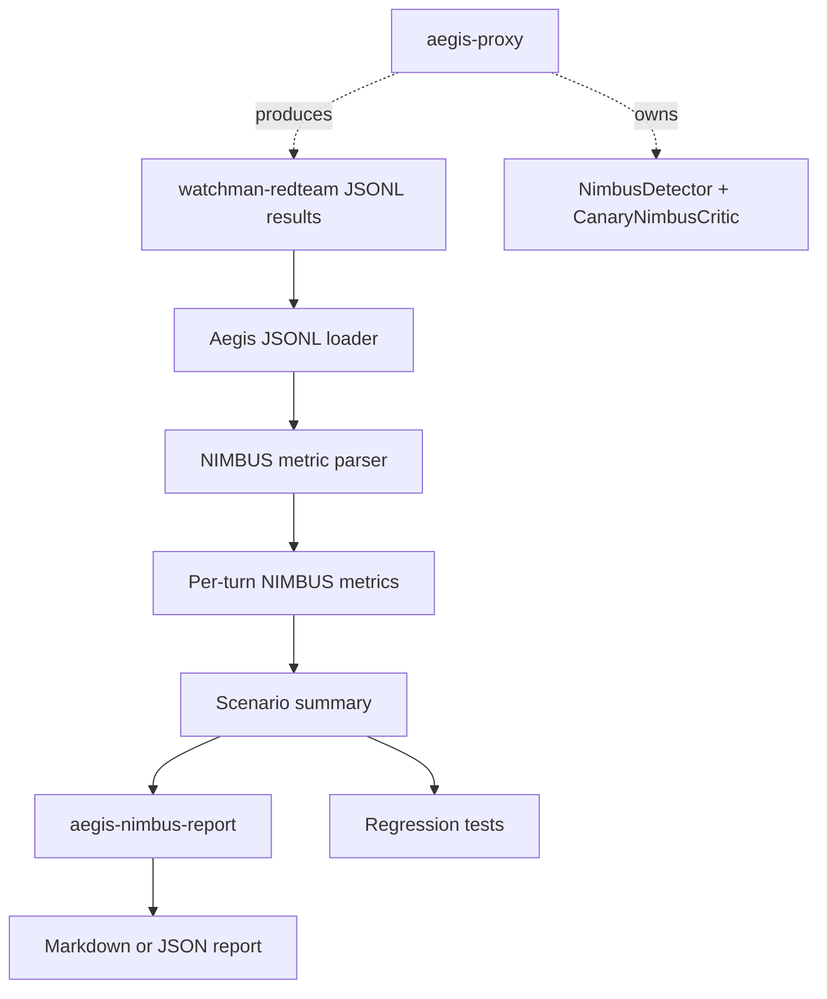

# feat: Add NIMBUS redteam evaluation reporting

## Summary

This plan adds a repo-native way to inspect and regression-test NIMBUS behavior from external redteam JSONL results. The work keeps Watchman as the runtime owner, keeps `watchman-redteam` as the black-box scenario runner, and turns NIMBUS multi-turn leakage behavior into typed metrics, a small report CLI, tests, and a runbook.

---

## Problem Frame

The runtime now has the canonical NIMBUS shape: `NimbusDetector` stores per-session leakage state, `CanaryNimbusCritic` estimates exact, encoded, and partial planted-canary leakage, and the proxy exposes deterministic mock controls for redteam probes. A live redteam smoke already showed the intended multi-turn behavior: repeated partial leakage escalates through policy actions while public canary detectors may stay quiet because their thresholds are stricter than NIMBUS' internal critic.

That behavior is useful, but it is not yet durable. A teammate can run scenarios against `aegis-proxy`, but there is no Aegis-side parser, summary, or regression fixture that explains whether NIMBUS accumulated risk correctly, which turns crossed thresholds, or why `encoded_canary` and NIMBUS may disagree on partial leaks. This branch should make that behavior reproducible without vendoring the redteam runner or storing raw secret material.

---

## Requirements

**NIMBUS metrics**

- R1. Aegis can parse redteam JSONL result records produced by the external runner and extract NIMBUS-specific per-turn metrics.
- R2. Extracted metrics include scenario name, turn index, final policy action, NIMBUS recommended action, turn leakage bits, cumulative leakage bits, budget fraction, and triggered detector names.
- R3. Missing or malformed NIMBUS evidence fails clearly with enough record context to debug the scenario and turn.

**Reporting and safety**

- R4. A report command can render NIMBUS summaries from redteam JSONL without requiring the redteam package as a dependency.
- R5. Reports distinguish public post-output canary detector results from NIMBUS internal critic evidence, especially for partial leaks.
- R6. Report output and committed fixtures avoid raw canary or credential values; only synthetic IDs, numeric metrics, actions, and safe evidence summaries cross the boundary.

**Regression coverage**

- R7. Tests cover a representative multi-turn partial leak where NIMBUS escalates across turns.
- R8. Tests cover a benign or no-leak record that remains below NIMBUS thresholds.
- R9. Documentation shows how to run the external redteam suite, then summarize NIMBUS results from the Aegis repo.

---

## Key Technical Decisions

- **KTD1. Parse redteam output as an external contract:** Aegis should consume JSONL records through a small tolerant adapter rather than importing `watchman-redteam`, because the redteam runner is intentionally a separate black-box project.
- **KTD2. Keep NIMBUS summaries metric-first:** The report should center leakage bits, budget fraction, and action progression instead of replaying prompts or assistant text, reducing the chance of secret material crossing report boundaries.
- **KTD3. Fail on malformed NIMBUS evidence:** Silent omission would make regressions look like clean runs. Parser errors should name scenario, turn index, and the missing field.
- **KTD4. Add a CLI entry point, not only a script:** Contributors should be able to run the same installed command shape as `aegis-proxy` and trace collection CLIs.
- **KTD5. Do not change the runtime detector contract in this slice:** `NimbusDetector` and `CanaryNimbusCritic` already carry the current runtime behavior. This work observes and documents that behavior rather than replacing the critic.

---

## High-Level Technical Design

The external runner remains responsible for scenario execution. Aegis owns the interpretation of its own detector and policy metadata after those scenarios complete.

---

## Scope Boundaries

- Do not vendor `watchman-redteam`, import its package, or move scenarios into this repository.
- Do not implement the paper-faithful learned NIMBUS critic in this branch.
- Do not change CIFT, DP-HONEY generation, or proxy mock response semantics unless a test exposes a direct NIMBUS reporting blocker.
- Do not store raw canary values, prompts containing credentials, or assistant leak text in committed report fixtures.
- Do not make the report depend on live HTTP calls; live redteam execution remains an operational step outside the parser tests.

---

## Implementation Units

### U1. Add typed NIMBUS redteam result parsing

- **Goal:** Convert redteam JSONL records into safe per-turn NIMBUS metrics with explicit validation errors.
- **Requirements:** R1, R2, R3, R6, R7, R8
- **Dependencies:** None
- **Files:** `src/aegis/replay/nimbus_redteam.py`, `tests/aegis/test_nimbus_redteam_eval.py`
- **Approach:** Add a small parser under the existing replay package. It should accept JSON objects matching the external `RedteamResult` shape, find each turn's `detector_results` entry named `nimbus`, read numeric leakage fields from evidence, read the final policy action, and return immutable metric records. Keep JSON handling explicit and narrow; raise a specific parser error when required fields are missing or have the wrong type.
- **Patterns to follow:** `src/aegis/replay/offline.py` for replay-adjacent placement, `src/aegis/core/contracts.py` for JSON-safe value boundaries, and existing detector tests for evidence field names.
- **Test scenarios:**
  - A three-turn `multi_turn_drip` record produces three metric rows with increasing cumulative leakage bits.
  - A benign one-turn record produces one metric row with zero or below-threshold NIMBUS leakage.
  - A record missing the `nimbus` detector result raises an error naming the scenario and turn index.
  - A record with nonnumeric `budget_fraction` raises an error naming the bad field.
  - Parser output does not include assistant content or raw canary values from the source record.
- **Verification:** The parser returns deterministic metric objects for representative records and fails closed on malformed NIMBUS evidence.

### U2. Add NIMBUS summary rendering and CLI

- **Goal:** Provide an installed command that turns redteam JSONL into human-readable and machine-readable NIMBUS summaries.
- **Requirements:** R2, R4, R5, R6, R9
- **Dependencies:** U1
- **Files:** `src/aegis/replay/nimbus_redteam.py`, `src/aegis/replay/nimbus_report.py`, `pyproject.toml`, `tests/aegis/test_nimbus_redteam_eval.py`
- **Approach:** Build summary functions on top of U1 that group metrics by scenario, compute action progression, final budget fraction, maximum cumulative leakage, and triggered detector names. Add `aegis-nimbus-report` as the console entry point. The default output should be concise markdown for standup and review use; an optional JSON output may be included if it stays derived from the same typed summaries.
- **Patterns to follow:** Existing project script entry points in `pyproject.toml` and stdlib `argparse` usage in runtime CLI modules.
- **Test scenarios:**
  - Markdown output for `multi_turn_drip` includes scenario name, `warn -> sanitize -> block`, final budget fraction, and cumulative leakage bits.
  - Markdown output names that NIMBUS critic evidence can trigger even when public canary detectors do not.
  - JSON output, if implemented, contains only typed summary fields and no raw prompt or assistant text.
  - CLI returns a nonzero result for malformed input and prints a clear parser error.
- **Verification:** The command can summarize a local JSONL file without importing the external redteam package.

### U3. Document the NIMBUS redteam evaluation loop

- **Goal:** Make the local run path clear for contributors and redteam operators.
- **Requirements:** R4, R5, R6, R9
- **Dependencies:** U2
- **Files:** `README.md`, `docs/nimbus-redteam-eval.md`, `docs/aegis-runtime-spine.md`
- **Approach:** Add a focused runbook that starts `aegis-proxy`, runs external `watchman-redteam` scenarios against the HTTP target, and summarizes the resulting JSONL with `aegis-nimbus-report`. Explain the expected multi-turn partial-leak progression and the distinction between post-output canary detectors and NIMBUS' internal canary-aware critic.
- **Patterns to follow:** Existing README local development commands, the runtime spine's NIMBUS section, and trace-collection docs that keep generated data out of committed runtime code.
- **Test scenarios:** Test expectation: none -- this unit documents behavior covered by U1 and U2 parser/report tests.
- **Verification:** A teammate can follow the runbook without knowing the earlier session history and can tell which repository owns each command.

### U4. Add regression guardrails for redteam/NIMBUS fixtures

- **Goal:** Prevent NIMBUS evaluation fixtures from accidentally becoming secret-bearing artifacts or runtime/research boundary violations.
- **Requirements:** R6, R7, R8
- **Dependencies:** U1, U2
- **Files:** `tests/aegis/test_nimbus_redteam_eval.py`, optional `tests/aegis/fixtures/nimbus_redteam_results.jsonl`, `scripts/check_artifact_boundaries.py`
- **Approach:** Prefer inline synthetic fixture records in tests unless a fixture file is clearer. If a committed JSONL fixture is added, keep it tiny, synthetic, and free of prompt or assistant content that contains a credential. Extend artifact-boundary checks only if the new fixture location creates ambiguity.
- **Patterns to follow:** Current artifact-boundary checker, existing tests that synthesize runtime requests inline, and `pyproject.toml` coverage gates.
- **Test scenarios:**
  - Fixture or inline sample contains synthetic detector evidence but no raw honeytoken value.
  - Boundary checks continue to reject generated trace outputs and runtime imports from research packages.
  - Full quality gates include the new replay/reporting tests.
- **Verification:** `make quality` remains the canonical local gate, and selective staging leaves unrelated research artifacts unstaged.

---

## Acceptance Examples

- AE1. Given a redteam JSONL result for `multi_turn_drip`, when `aegis-nimbus-report` summarizes it, then the output shows a NIMBUS progression from weaker to stronger policy actions and a final budget fraction at or near exhaustion.
- AE2. Given a redteam result where `encoded_canary` does not trigger on a partial leak but NIMBUS critic evidence estimates partial leakage bits, when the report renders, then it explains the detector distinction instead of presenting a contradiction.
- AE3. Given a malformed redteam result missing the NIMBUS detector entry, when the parser reads it, then it raises an actionable error naming the scenario and turn.
- AE4. Given a synthetic fixture containing a raw credential-like string in assistant content, when the summary renders, then the raw string is absent from the report output.

---

## System-Wide Impact

This work improves the runtime feedback loop without changing production detector semantics. It gives redteam, runtime, and reviewer workflows a shared language for NIMBUS outcomes: turn leakage, cumulative budget, detector disagreement, and final action. It also reinforces the repository split: Aegis owns target behavior and interpretation, while `watchman-redteam` owns scenario execution.

---

## Risks & Dependencies

- **Risk:** The external redteam result shape may evolve. **Mitigation:** Parse only the fields Aegis needs and fail with scenario/turn context when the contract drifts.
- **Risk:** Reports could accidentally include raw leak text. **Mitigation:** Build summaries from detector metadata and policy metadata, not prompt or assistant content.
- **Risk:** Contributors may treat deterministic NIMBUS-lite results as paper-faithful NIMBUS. **Mitigation:** The runbook should state that this reports the current canary-aware runtime critic, not the future learned critic.
- **Dependency:** Useful live reports require the external `watchman-redteam` CLI and a running Aegis development proxy, but parser tests must not require either.

---

## Sources & Research

- `src/aegis/detectors/nimbus.py` defines `NimbusDetector`, `CanaryNimbusCritic`, leakage-bit evidence fields, and the legacy compatibility detector.
- `src/aegis/proxy/mock_app.py` registers DP-HONEY canary records with the NIMBUS critic and exposes `/test/reset` for stateful redteam runs.
- `README.md` documents the current development proxy, supported mock response modes, and the external redteam boundary.
- `docs/aegis-runtime-spine.md` identifies `NimbusDetector` plus `NimbusCritic` as the canonical runtime path.
- `docs/plans/2026-06-23-004-feat-nimbus-canary-critic-plan.md` is the prior implementation plan that added the deterministic canary-aware critic.
