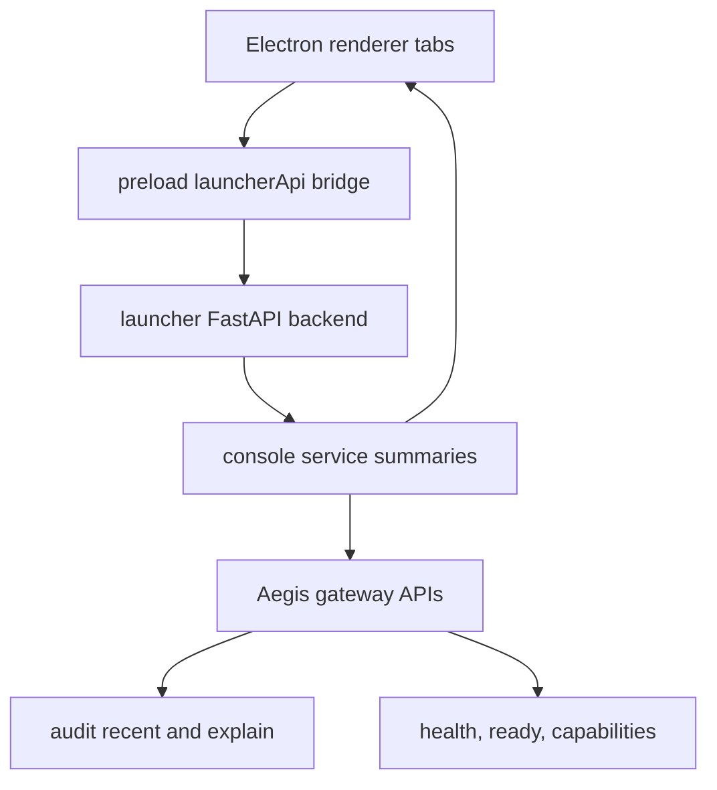

# feat: Add desktop observability surface

## Summary

Add an observability tab set to the Aegis Watchman desktop launcher so operators can see recent gateway decisions, detector activity, stage timelines, and latency evidence without opening the separate web console.

---

## Problem Frame

The launcher can start Ollama, CIFT, the gateway, and verification smokes, but it does not show what Aegis is doing after traffic flows. The repo already has audit and console summarization APIs; the desktop app should reuse that evidence and make DP-HONEY, CIFT, NIMBUS, policy, and latency visible in the operator surface.

---

## Requirements

**Operator visibility**

- R1. The desktop app shows recent Aegis decisions with trace id, final action, provider status, triggered detectors, and request latency.
- R2. The desktop app lets the operator inspect a selected trace timeline across normalize, credential slot, DP-HONEY, CIFT, provider guard, provider, canary, NIMBUS, policy, and audit stages.
- R3. The desktop app surfaces detector-level evidence for DP-HONEY, CIFT, NIMBUS, provider egress, canary, and fail-closed events using redacted audit summaries.

**Latency**

- R4. The desktop app reports recent internal Aegis latency and detector latency aggregates from audit records.
- R5. The latency view must not claim direct provider overhead unless a paired direct-provider baseline exists.

**Integration**

- R6. The renderer obtains observability through the existing launcher API bridge rather than fetching gateway endpoints directly.
- R7. The launcher backend reuses `src/aegis/console/service.py` summarization instead of duplicating audit interpretation in JavaScript.
- R8. Gateway offline or audit-empty states render as useful empty states, not blank panels.

---

## Key Technical Decisions

- KTD1. **Server-side summarization:** Add launcher backend observability endpoints that call the console service with gateway settings derived from the active launcher profile. This keeps audit schema handling in Python and avoids renderer CORS or direct gateway coupling.
- KTD2. **Tabbed desktop surface:** Add tabs inside the Electron renderer for Launch, Activity, Latency, Detectors, and Trace. The current launcher remains the default tab, while observability views share the same native-soft styling.
- KTD3. **Latency honesty:** Compute p50 and p95 from recent audit `latency_ms` and detector `latency_ms`, and label them as Aegis/audit-derived latencies. Direct provider overhead remains unavailable until a paired benchmark harness exists.
- KTD4. **Redacted evidence only:** Use console summaries and detector result summaries rather than raw audit payloads so the app does not display secrets or canary matches.

---

## High-Level Technical Design

The renderer keeps using `window.aegisDesktop.launcherApi`. The launcher backend exposes observability endpoints that wrap existing console summaries and return compact JSON for desktop display.

---

## Implementation Units

### U1. Launcher Observability API

- **Goal:** Add backend endpoints that expose overview, recent events, trace explanation, and latency aggregates to the desktop app.
- **Requirements:** R1, R2, R3, R4, R5, R6, R7, R8
- **Dependencies:** None
- **Files:** `src/aegis/launcher/service.py`, `src/aegis/launcher/app.py`, `tests/aegis/test_launcher.py`
- **Approach:** Add service methods that build console settings from the active profile, call `console_overview`, `console_events`, and `console_trace`, and compute a small latency summary from recent event summaries. Return an unavailable state when the gateway cannot be reached.
- **Patterns to follow:** Existing `LauncherService.state`, `LauncherService.preflight`, and FastAPI route shape in `src/aegis/launcher/app.py`.
- **Test scenarios:** Gateway-backed fetcher returns overview and recent audit events; empty audit returns zero counts and no selected trace; failed gateway fetcher returns an unavailable payload without raising to the renderer; latency summary reports count, p50, p95, and detector totals from redacted event summaries.
- **Verification:** Launcher API tests prove the endpoint contracts and degraded states without requiring a live gateway.

### U2. Renderer State and Tab Navigation

- **Goal:** Add tab navigation and state loading for launch and observability views.
- **Requirements:** R1, R2, R3, R4, R6, R8
- **Dependencies:** U1
- **Files:** `desktop/aegis-launcher/renderer/index.html`, `desktop/aegis-launcher/renderer/index.js`, `desktop/aegis-launcher/renderer/index.css`
- **Approach:** Add a tab list in the titlebar or main shell and render Launch, Activity, Latency, Detectors, and Trace panels from a single `state.observability` object. Keep polling lightweight and reuse the existing refresh path.
- **Patterns to follow:** Existing renderer `state`, `loadAll`, `renderSection`, `summaryRow`, and neumorphic panel classes.
- **Test scenarios:** Manual browser verification covers initial loading, gateway offline empty state, tab switching, selected trace display, and refresh behavior. Automated Node tests are not expected because the renderer has no current DOM test harness.
- **Verification:** The app renders the current Launch view unchanged by default and the new tabs do not blank the shell when observability is unavailable.

### U3. Activity and Trace Panels

- **Goal:** Show recent request decisions and selected trace timeline in desktop form.
- **Requirements:** R1, R2, R3, R8
- **Dependencies:** U1, U2
- **Files:** `desktop/aegis-launcher/renderer/index.js`, `desktop/aegis-launcher/renderer/index.css`
- **Approach:** Render a recent events list with action/provider/detector badges. Selecting an event displays the stage timeline, detector result table, and safe runtime evidence summary.
- **Patterns to follow:** Console service event fields `stage_timeline`, `detector_results`, `runtime_evidence`, and existing launcher timeline component structure.
- **Test scenarios:** Event with CIFT block shows provider skipped; event with DP-HONEY substitution counts as substitution; event with NIMBUS warning shows warning; no event shows an empty trace state.
- **Verification:** A selected audit trace makes it clear which detector made the decision and whether provider generation was skipped.

### U4. Latency and Detector Dashboard

- **Goal:** Show recent Aegis latency, detector latency, and detector activity in dashboard cards.
- **Requirements:** R3, R4, R5, R8
- **Dependencies:** U1, U2
- **Files:** `desktop/aegis-launcher/renderer/index.js`, `desktop/aegis-launcher/renderer/index.css`
- **Approach:** Render aggregate request latency cards, detector latency rows, detector activity counters, and an explicit note when direct-provider baseline overhead is not available. Keep values in milliseconds and include sample size.
- **Patterns to follow:** Existing console detector activity counters and detector result latency fields.
- **Test scenarios:** Multiple events produce p50 and p95; missing latency values are ignored; no baseline shows "not measured"; detector counts line up with console activity counters.
- **Verification:** The latency panel provides usable numbers without overstating overhead.

### U5. Focused Verification

- **Goal:** Verify backend contracts and desktop packaging for the new observability surface.
- **Requirements:** R1, R2, R3, R4, R8
- **Dependencies:** U1, U2, U3, U4
- **Files:** `tests/aegis/test_launcher.py`, `desktop/aegis-launcher/test/backend-process.test.js`
- **Approach:** Add Python tests for launcher observability contracts and run the existing Electron Node tests. Run a macOS pack build to catch renderer syntax and packaging regressions.
- **Patterns to follow:** Existing launcher and console tests.
- **Test scenarios:** Unit tests cover backend observability. Existing Node tests cover Electron backend plumbing. Manual or packaged-app launch validates renderer behavior.
- **Verification:** Tests pass and the packaged app starts with the new tab controls available.

---

## Scope Boundaries

### In Scope

- Desktop observability views over existing audit and console summaries.
- Recent-event latency and detector latency aggregates.
- Clear degraded states for gateway offline, empty audit, or missing trace.

### Deferred to Follow-Up Work

- Paired direct-provider benchmark harness for true overhead measurement.
- Charts with persisted time series or durable dashboard history.
- Learned NIMBUS training or DP-HONEY behavior changes.
- Remote fleet observability or multi-node dashboards.

---

## System-Wide Impact

This change improves operator visibility without changing request enforcement. It adds read-only launcher endpoints over existing gateway evidence and a renderer surface over those endpoints. It should not weaken fail-closed behavior, CIFT certification binding, or audit redaction.

---

## Risks & Dependencies

- **Gateway availability:** Observability depends on the gateway being reachable. The launcher must show offline state rather than throwing renderer errors.
- **Schema drift:** Audit and console summaries may evolve. Reusing `src/aegis/console/service.py` reduces duplicate schema handling.
- **Latency interpretation:** Audit latency is not the same as direct-provider overhead. The UI must label it accurately until a paired benchmark exists.
- **Dirty worktree:** The repo has unrelated modified and untracked CIFT artifacts. Implementation should avoid touching them.

---

## Sources & Research

- `src/aegis/launcher/service.py` and `src/aegis/launcher/app.py` define the launcher API and process state patterns.
- `src/aegis/console/service.py` already summarizes gateway readiness, recent audit events, detector activity, CIFT, NIMBUS, stage timelines, and safe runtime evidence.
- `desktop/aegis-launcher/renderer/index.js`, `desktop/aegis-launcher/renderer/index.html`, and `desktop/aegis-launcher/renderer/index.css` define the current desktop renderer shell and native-soft visual system.
- `tests/aegis/test_console.py` and `tests/aegis/test_launcher.py` provide backend contract test patterns.
